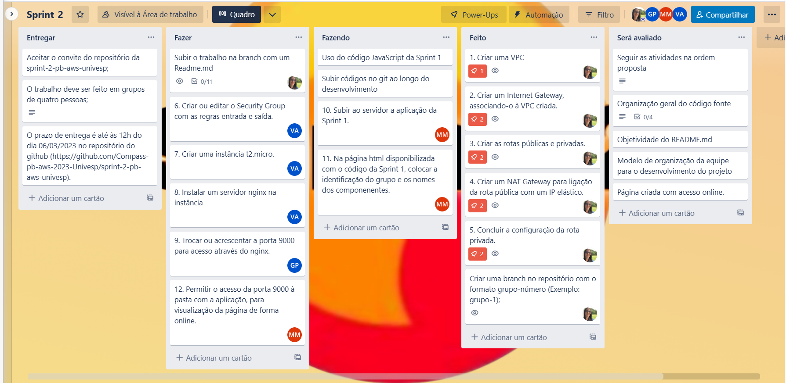
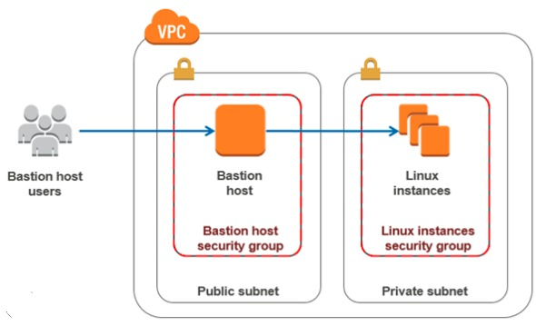
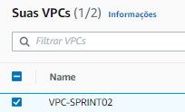
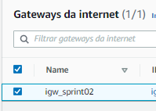
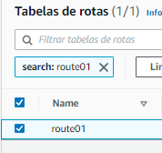
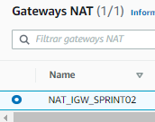
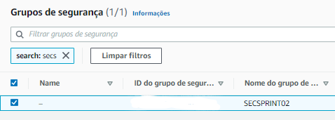

# Avaliação Sprint 2 - Programa de Bolsas Compass UOL / AWS e Univesp

Avaliação da segunda sprint do programa de bolsas Compass UOL para formação em machine learning para AWS.

***

## Execução (Código Fonte)

Exposição na web do projeto da Sprint 1, com a utilização da AWS Cloud.

**Especificações**:

Passos de execução do projeto em uma conta AWS disponibilizada no Programa de Bolsas:

1. Criar uma VPC.
2. Criar um Internet Gateway, associando-o à VPC criada.
3. Criar as rotas públicas e privadas.
4. Criar um NAT Gateway para ligação da rota pública com um IP elástico.
5. Concluir a configuração da rota privada.
6. Criar ou editar o Security Group com as regras entrada e saída.
7. Criar uma instância t2.micro.
8. Instalar um servidor nginx na instância.
9. Trocar ou acrescentar a porta 9000 para acesso através do nginx.
10. Subir ao servidor a aplicação da Sprint 1.
11. Na página html disponibilizada com o código da Sprint 1, colocar a identificação do grupo e os nomes dos componenentes.
12. Permitir o acesso da porta 9000 à pasta com a aplicação, para visualização da página de forma online.

O seguinte esquema sintetiza a arquitetura proposta nesta avaliação:

***

## O que será avaliado?

- Uso do código JavaScript da Sprint 1
- Seguir as atividades na ordem proposta
- Subir códigos no git ao longo do desenvolvimento
- Organização geral do código fonte
  - Estrutura de pastas
  - Estrutura da logica de negócio
  - Divisão de responsabilidades em arquivos/pastas distintos
  - Otimização do código fonte (evitar duplicações de código)
- Objetividade do README.md
- Modelo de organização da equipe para o desenvolvimento do projeto
- Página criada com acesso online.

***

## Entrega

- Aceitar o convite do repositório da sprint-2-pb-aws-univesp;
- **O trabalho deve ser feito em grupos de quatro pessoas**;
  - Evitar repetições de grupos da sprint anterior;
- Criar uma branch no repositório com o formato grupo-número (Exemplo: grupo-1);
- Subir o trabalho na branch com um [Readme.md](README.md)
  - documentar detalhes sobre como a avaliação foi desenvolvida
  - dificuldades conhecidas
  - como utilizar o sistema
  - 🔨 código fonte desenvolvido (Sugestão: pasta `src`)
  - configuração nginx
  - URL para acesso à página
- O prazo de entrega é até às 12h do dia 06/03/2023 no repositório do github ([https://github.com/Compass-pb-aws-2023-Univesp/sprint-2-pb-aws-univesp](https://github.com/Compass-pb-aws-2023-Univesp/sprint-2-pb-aws-univesp)).

<<<<<<< HEAD
---

# **Grupo 3 - Sprint 2** 
Este projeto foi solicitado pela https://compass.uol/en/home/,  em um grupo de estágio, e realizado por 4 estudantes: 
        1. Guilherme de Moraes Pereira
        2. Marcos Zaparoli Martins
        3. Luciene Godoy da Silva
        4. Viviane Silva Alves       

O Grupo reunui-se, para dividir suas tarefas no https://trello.com/.  e depois de muitas discurssões, pesquisa e esclarecimento de dúvidas mutuas.

## Arquitetura do projeto:
\
https://aws.amazon.com/pt/blogs/security/how-to-record-ssh-sessions-established-through-a-bastion-host/
## Solução para a atividade da Sprint 2
Para utilizar esta solução você precisará:
- clonar o repositório;
- Abrir uma conta na AWS https://aws.amazon.com;
- Criar:\
    ✅uma VPC.\
    >

    ✅um Internet Gateway, associando-o à VPC criada.\
    >

    ✅as rotas públicas e privadas.\
    >

    ✅um NAT Gateway para ligação da rota pública com um IP elástico\
    >

    ✅configuramos uma rota privada.\
    ✅o Security Group com as regras entrada e saída\
    >
    ✅uma instância t2.micro.
- Instalar:\
   >
    ✅servidor nginx na instância.
- acrescentar: a porta 9000 para acesso através do nginx.
- subir no servidor:\
    ✅a aplicação da Sprint 1.
Permitir:\
    ✅o acesso pela porta 9000 à pasta com a aplicação, para visualização da página de forma online.\

Foi Utilizado o código da pasta src (Sprint 1 - grupo 5) pra subir no servidor no servidor AWS. 

>Observação:
> Foi Utilizado o código da pasta src e feito o  deploy no servidor AWS.\
>Segue o link da página 👉http/
=======

#**Eplicando a nossa Solução para a atividade acima
O Grupo reunui-se pelo Teams, para dividir suas tarefas. 

As tarefas foram organizadas no Trello.
    - Se imagens:
=======
As tarefas foi organizadas no Trello.
    - Segue imagens:

O contato contante durante a contrução da Sprinte foi feita pelo WhahtsApp.
📚Muitas discurssões, pesquisa e esclarecimento de dúvidas mutuas.

##A seguir a relação do que foi pedido e criado na Sprint_2

Criamos: 
    ✅uma uma VPC. 
    ✅um Internet Gateway, associando-o à VPC criada. 
    ✅as rotas públicas e privadas. 
    ✅um NAT Gateway para ligação da rota pública com um IP elástico. 
    ✅configuramos uma rota privada. 
    ✅o Security Group com as regras entrada e saída. 
    ✅uma instância t2.micro. 
Instalamos: 
    ✅servidor nginx na instância. 
acrescentamos: a porta 9000 para acesso através do nginx. 
Subimos no servidor: 
    ✅a aplicação da Sprint 1. 
Disponibilizamos: 
    ✅em uma página html o código da Sprint 1, colocar a identificação do grupo e os nomes dos componenentes. 
Permitimos: 
    ✅o acesso da porta 9000 à pasta com a aplicação, para visualização da página de forma online. 

Foi Usado o código da pasta src na página que foi feito o deploy no servidor web AWS. 
Segue o link da página 👉http/
>>>>>>> 5eeb90d054f87619f701e1413ec5587a3e01d5c5

